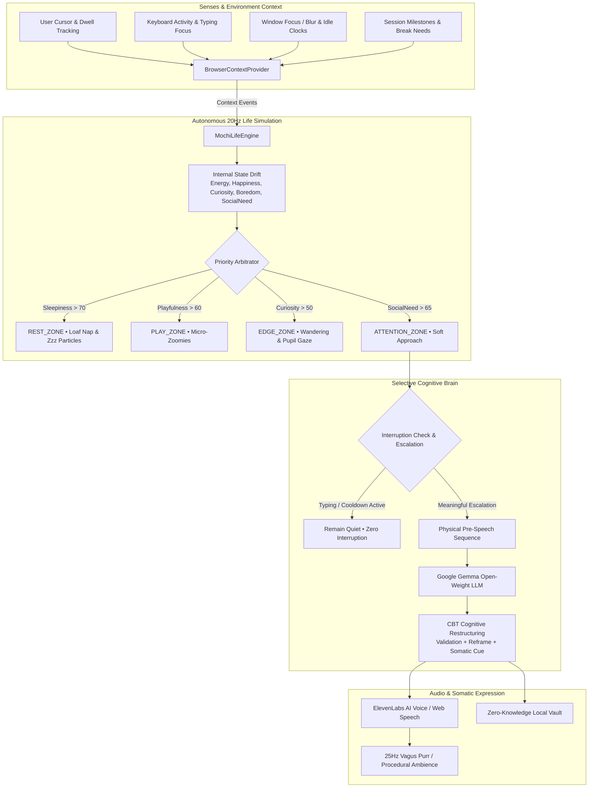
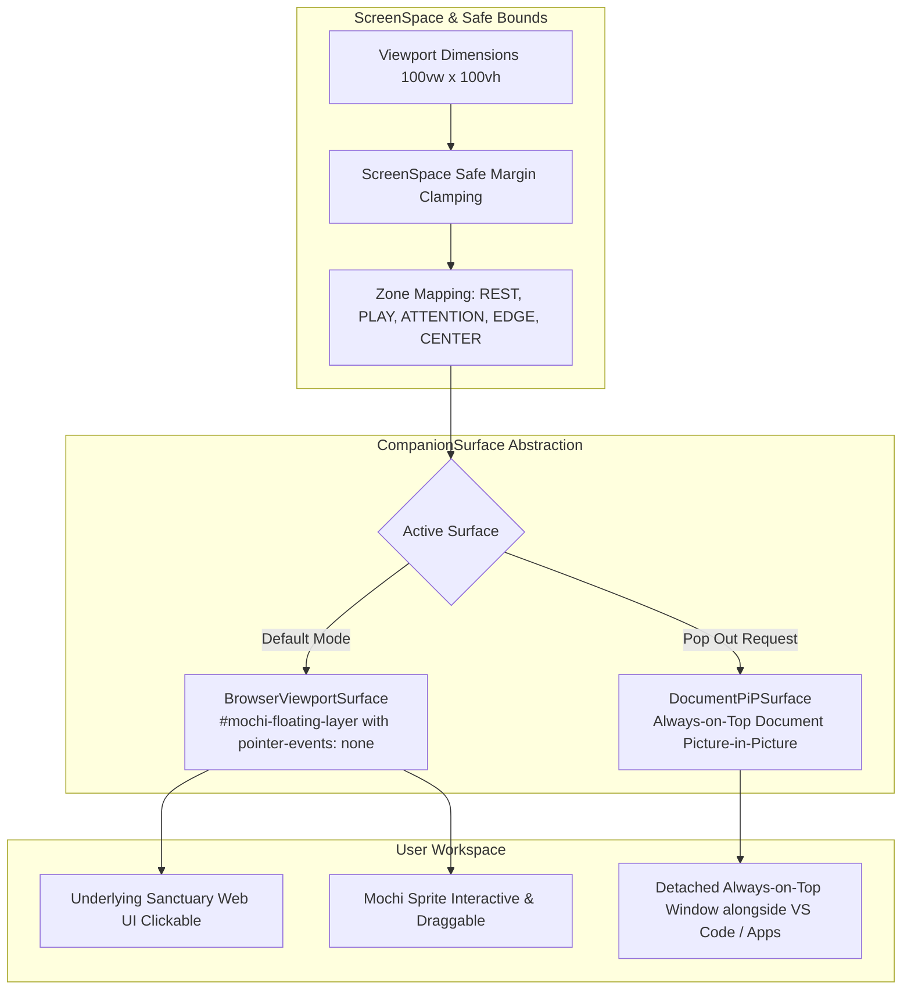

# Sanctuary — Technical Architecture & Cognitive Pipeline

> **Sanctuary** is a 100% private, on-device emotional companion and living roommate pet ("Mochi") designed to accompany users through late-night work sessions, burnout, and acute anxiety spirals.

---

## 1. High-Level Architecture Overview

Sanctuary separates **Continuous Real-Time Living Simulation** from **Selective Cognitive Reasoning**:



---

## 2. Core Principle: Gemma is the Cognitive Core, Not the Animation Loop

### Why We Do NOT Run Gemma at 20Hz:
- Running an LLM on every animation frame (20 times/second) or on every mouse move would cause massive GPU thermal throttling, drain battery in minutes, and introduce 500ms jitter into fluid animations.
- A true living creature's body (blinking, breathing, pupil gaze tracking, idle loafing, wandering) runs locally at zero latency and zero compute cost.
- **Google Gemma** is awakened selectively when **higher-level cognition** is required:
  1. Interpreting nuanced user confessions and vulnerability.
  2. Performing Cognitive Behavioral Therapy (CBT) distortion deconstruction (identifying catastrophizing, mind reading, all-or-nothing thinking).
  3. Formulating empathetic Socratic reframes and grounding somatic actions.
  4. Generating context-sensitive roommate check-ins during long work sessions.

---

## 3. The 3-Tier Gemma Inference Pipeline

Sanctuary implements a graceful multi-tier inference strategy:

```text
┌─────────────────────────────────────────────────────────────────────────┐
│ Tier 1: Local In-Browser WebGPU (Primary Zero-Knowledge Hero)           │
│ Engine: @mlc-ai/web-llm                                                  │
│ Model: Google Gemma-2-2B-IT (gemma-2-2b-it-q4f16_1-MLC)                  │
│ Execution: 100% on user's GPU via WebGPU shader pipelines                │
│ Privacy: 0 Bytes transmitted over the network                           │
└────────────────────────────────────┬────────────────────────────────────┘
                                     │ (If WebGPU not supported)
                                     ▼
┌─────────────────────────────────────────────────────────────────────────┐
│ Tier 2: Local Ollama Endpoint (Desktop Offline Bridge)                  │
│ Engine: Localhost HTTP Bridge (http://localhost:11434/api/chat)         │
│ Model: gemma2:2b (or user-selected local Gemma tag)                     │
│ Execution: Local CPU / GPU via Ollama runtime                            │
│ Privacy: 100% Localhost, zero cloud dependency                          │
└────────────────────────────────────┬────────────────────────────────────┘
                                     │ (If no local runtime configured)
                                     ▼
┌─────────────────────────────────────────────────────────────────────────┐
│ Tier 3: Optional Remote Cloud Gateway / Dynamic Cognitive Synthesizer   │
│ Engine: Hugging Face Serverless / OpenRouter (User API key required)    │
│ Model: google/gemma-2-9b-it                                             │
│ Fallback: Dynamic Contextual Socratic Cognitive Synthesizer             │
└─────────────────────────────────────────────────────────────────────────┘
```

---

## 4. Subsystem Details

### 4.1. `MochiLifeEngine` (`mochi-engine.js`)
* **Continuous State Vector:** Evolving floats (`energy`, `happiness`, `curiosity`, `boredom`, `playfulness`, `sleepiness`, `socialNeed`).
* **Conceptual Spatial Zones:**
  * `REST_ZONE`: Bottom-right quiet corner for loaf naps.
  * `PLAY_ZONE`: Open middle/top area for joyful zoomies.
  * `ATTENTION_ZONE`: Near active cursor for attentive listening.
  * `EDGE_ZONE`: Border alignment like classic desktop screen pets (Neko).
  * `CENTER_ZONE`: Canvas observation area.
* **Physics & Senses:** Continuous velocity damping, facing direction (`scaleX`), head tilts, and sub-20ms trigonometric eye pupil tracking.

### 4.2. `ContextProvider` (`context-provider.js`)
* **Abstract Interface:** Decouples environmental perception from the host environment (Browser DOM vs future Tauri/Electron Desktop wrappers).
* **Sensory Signals:** Cursor velocity, proximity dwell time, keyboard typing focus detection (to prevent interrupting work), window blur/focus, idle timers.
* **Event Pipeline:** Dispatches clean events (`USER_ACTIVE`, `USER_IDLE`, `USER_RETURNED`, `CURSOR_NEAR_MOCHI`, `CURSOR_LEFT_MOCHI`, `USER_PETTED_MOCHI`, `LONG_SESSION`) directly into `MochiLifeEngine`.

### 4.3. Interruption Intelligence & The Art of Silence
* If the user is actively typing, proactive voice is **strictly suppressed**.
* Minimum 40-second speech cooldown prevents chatter fatigue.
* Mochi spends the majority of its time quietly loafing, stretching, or napping — respecting the user's focus.

### 4.4. Zero-Knowledge Private Vault
* Conversational reflections and CBT reframings are saved strictly to the browser's local `localStorage` sandbox.
* Includes one-click Markdown journal export for personal Obsidian/Notion vaults.
* Zero third-party analytics, zero telemetry tracking, zero cloud logging.

---

## 5. Phase 3: Screen-Space Floating Companion & Surface Abstraction

Sanctuary implements a dedicated, transparent floating layer that liberates Mochi from rectangular card containers into persistent screen-space coexistence:



### 5.1. `ScreenSpace` Abstraction
- Viewport coordinate mapping with safe padding (`ScreenSpace.getSafeBounds(margin, petWidth, petHeight)`).
- Natural collision clamping on dragging, autonomous wandering, and window resize events.
- Prevents Mochi from ever leaving the visible boundaries of the display.

### 5.2. `CompanionSurface` & Document Picture-in-Picture
- **`BrowserViewportSurface`**: Dedicated transparent viewport overlay with `pointer-events: none` on the container and `pointer-events: auto` on Mochi, allowing all underlying website buttons and tools to be clicked freely.
- **`DocumentPiPSurface`**: Uses the modern standard `documentPictureInPicture` API to pop Mochi into an always-on-top window that persists on screen while the user works in code editors, terminals, or other browser tabs.
- **Browser Security Boundary Note**: Standard web browsers cannot draw arbitrary OS-level overlays across unrelated native desktop applications without user-invoked Picture-in-Picture or a native shell wrapper (e.g. Tauri/Electron). Sanctuary truthfully implements this via standard Document PiP and transparent viewport overlay rather than making exaggerated claims.

