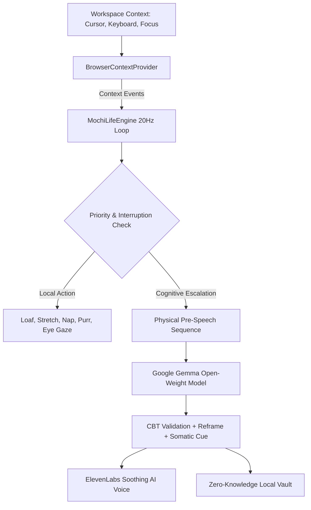

# Hacktoberfest — Build for a Friend: Sanctuary

*Submission for the [Hacktoberfest Weekend Challenge: Build for a Friend](https://dev.to/challenges/hacktoberfest-weekend-2026-10-01)*

---

## What I Built

I built **Sanctuary** — a 100% private, on-device emotional companion and living roommate pet named **Mochi**, powered by **Google's open-weight Gemma LLM** and **ElevenLabs AI voice infrastructure**.

Instead of being a static form or a chatbot that sends generic pop-up notifications, Mochi lives as an autonomous creature with a **continuous 20Hz local life simulation**:
- **Living Body:** Independent movement across conceptual desk zones, stretching, loafing, and sleeping with floating Zzz particles.
- **Sensory Awareness:** Sub-20ms trigonometric eye pupil tracking and proximity dwell detection relative to the user's cursor.
- **Gemma Cognitive Core:** Escalates to Google Gemma on-device (via WebGPU or Ollama) for Cognitive Behavioral Therapy (CBT) distortion deconstruction (catastrophizing, all-or-nothing thinking, mind reading) into compassionate, actionable reframing.
- **Lifelike Voice:** Speaks softly and reassuringly through ElevenLabs Flash v2.5.
- **Somatic Calm:** Features guided 4-7-8 parasympathetic breathing synced with procedural 25Hz cat purring audio and pink-noise rain.

---

## Who I Built It For

I built Sanctuary for my close friend **Alex**, an engineer who struggles with late-night burnout, insomnia, and acute 2:00 AM spiral anxiety.

---

## The Problem

When Alex's anxiety hits at night:
1. **Privacy Roadblocks:** Alex refused to use cloud-hosted commercial AI tools for mental health out of valid fear that vulnerable breakdowns would be logged, analyzed, or used to train corporate models.
2. **Cognitive Fatigue:** When panicking, formulating text prompts into an empty chat box is exhausting. Alex needed an AI companion that was **proactively present** — quietly sitting beside the workspace, noticing when work runs too long, and offering gentle grounding without being intrusive.

---

## How Mochi Works

Mochi is governed by two decoupled systems:
1. **Continuous 20Hz Life Simulation (`mochi-engine.js`):**
   - Manages an evolving internal state vector: `energy`, `happiness`, `curiosity`, `boredom`, `playfulness`, `sleepiness`, and `socialNeed`.
   - Priority hierarchy arbitrates behavior: User Touch $\rightarrow$ Active Dialogue $\rightarrow$ Attention Seeking $\rightarrow$ Playful Zoomies $\rightarrow$ Wandering $\rightarrow$ Idle Loafing $\rightarrow$ Sleep.
2. **Sensory Context Pipeline (`context-provider.js`):**
   - Tracks cursor velocity, dwell time, session duration, and keyboard typing focus.
   - If the user is actively typing, Mochi **strictly suppresses interruptions**.
   - Direct somatic reactions (waking up, purring, stretching) happen at zero latency without making LLM calls.

---

## How Gemma Is Used

Google's open-weight **Gemma** serves as Mochi's higher-level cognitive brain:
- **Selective Escalation:** Gemma is invoked when the user confides a worry, asks for guidance, or when Mochi escalates a long-session break check-in.
- **Physical Pre-Speech Sequence:** Before speaking, Mochi approaches, pauses, tilts its head, and breathes, ensuring natural creature presence.
- **Cognitive Restructuring:** Gemma analyzes automatic negative thoughts, identifies underlying cognitive distortions, tests evidence vs. emotional fears, and generates:
  1. A compassionate friend perspective.
  2. An objective factual reframe.
  3. A somatic micro-grounding action.

---

## Technical Architecture

---

## Local AI Inference Tiers

1. **Tier 1 (Hero / In-Browser WebGPU):** `@mlc-ai/web-llm` running `gemma-2-2b-it-q4f16_1-MLC` natively on the user's GPU. 0 Bytes sent to any server.
2. **Tier 2 (Desktop Localhost):** Ollama endpoint at `http://localhost:11434` running `gemma2:2b`.
3. **Tier 3 (Cloud Fallback):** Optional Hugging Face Serverless API with user-provided key.

---

## Voice Synthesis

- **Primary:** ElevenLabs Text-to-Speech API with streaming playback and ultra-low latency voice personas (*Rachel*, *Sarah*, *Charlie*, *Daniel*).
- **Fallback:** Device Native Web Speech API for 100% offline, zero-configuration voice.

---

## Privacy & Open Source Setup

- **Zero-Knowledge Privacy:** 100% client-side execution; reflections are stored strictly in browser `localStorage`.
- **Zero Hardcoded Secrets:** No API keys or credentials exist in the codebase.
- **Built-in Diagnostic Suite:** Users and judges can verify live inference, context injection, and privacy compliance by clicking the **Brain: Gemma** status badge in the header or running `window.runGemmaDiagnostics()` in DevTools.

---

## Prize Categories

- **Best Use of Gemma:** Google's open-weight Gemma model powers the on-device CBT cognitive reasoning and contextual reflection pipeline.
- **Best Use of ElevenLabs:** Lifelike, emotive voice synthesis powers soothing roommate check-ins and guided grounding audio.
